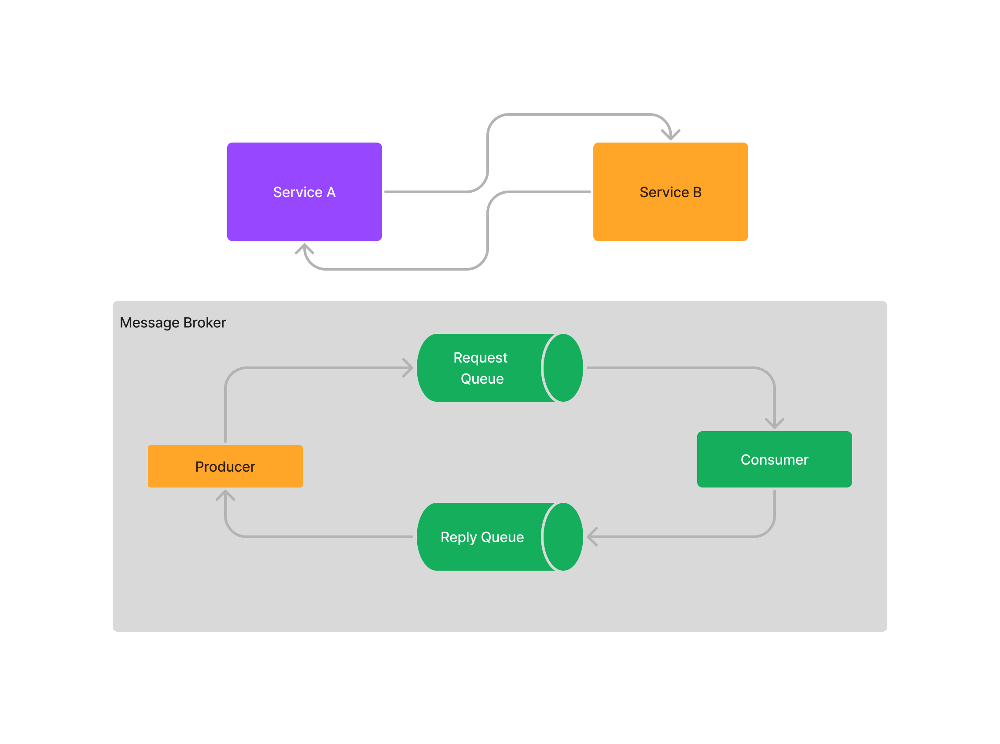

# Kafka Request-Reply Pattern with Node.js

## Introduction

This project demonstrates the usage of the Request-Reply pattern with Apache Kafka and the development of a Node.js application to implement this pattern. The Request-Reply pattern is widely used in distributed systems to enable asynchronous communication between components. It allows one component to send a request to another component and wait for a response.

In this project, we will be using Apache Kafka as the messaging system for implementing the Request-Reply pattern. Kafka is a distributed event streaming platform that is highly scalable and fault-tolerant. It provides an asynchronous approach to component communication.

The Node.js application that will be developed in this project consists of two components: the producer and the consumer. The producer is responsible for sending requests to Kafka on a specific topic, and the consumer is responsible for receiving the requests, processing them, and sending back responses to the producer.

## Prerequisites

Before running the project, make sure you have the following installed on your machine:

- Node.js: version 10 or above
- Apache Kafka: version 2.0 or above

## Setup

1. Clone the project repository: `git clone https://github.com/rodrigoPQF/kafka_request_reply`
2. Navigate to the project directory: `cd kafka_request_reply`
3. Install Node.js dependencies: `npm install`

## Usage

1. Start the Kafka server `docker compose up`.
2. Start the request: `npm run request`
3. Start the response: `npm run response`

The producer will send a request to Kafka and wait for the consumer's response. The consumer will process the request and send the response back to the producer. The messages will be displayed in the console of both the producer and the consumer.

## Conclusion

The Request-Reply pattern is an effective approach for asynchronous communication between components in distributed systems. In this project, we explored the usage of this pattern with Apache Kafka and implemented a Node.js application that demonstrates the exchange of asynchronous messages between a producer and a consumer.

You can extend this project by adding more complex processing logic to the consumer or by implementing multiple consumers to further scale the system. Apache Kafka provides a robust platform for building highly scalable and reliable distributed systems.
